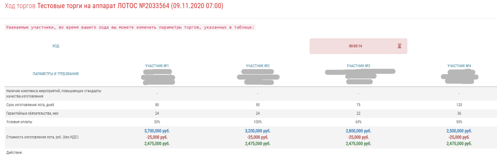

# Lotus test job

&nbsp;
## Задание

Создать онлайн комнату для проведения торгов как на скриншоте:



Необходимо организовать только синхронную работу таймера для всех подключенных участников. 

Дополнительные параметры:
  1. Время на ход - фиксированное: 2 минуты
  2. Для примера можно создать 3-5 участников и сформировать ссылку для просмотра работы комнаты.
  3. Функционал участников не нужно реализовывать. Они только наблюдают за ходом таймера.
  4. Таймер должен работать не зависимо от наличия подлкюченных участников.

Стек для реализации открытый, но предпочтительно использовать React.

Дизайн можно не соблюдать строго. Важно реализовать работу таймера, который не зависит от присутствия в комнате участников!

Результат необходимо выхожить в облако для демонстрации работы в реальном времени.

[Ссылка на оригинал задания](https://github.com/lotus-uems/Test_React_Trade).

&nbsp;

## Демо

Реализована имитация совершения ставок четырьмя участниками (только переход хода через случайное время до истечения таймера). Плюс есть некоторый интерактив - можно передавать ход какому-либо участнику (кроме того, у которого активный таймер), кликая на его название.

!!! Внимание !!!  
Участника четыре, таблица с ними может не вмещаться на экране, а активный ход может быть у третьего/четвертого участника и таймер можно сначала не заметить, если не прокрутить до них.

[http://discoserver.ru:3333/](http://discoserver.ru:3333/)

&nbsp;

## Использование

### Проще всего использовать docker

```bash
docker compose up
# или
docker-compose up
```

&nbsp;

### Либо чуть больше ручной работы

Сначала установите зависимости

```bash
npm ci
```

&nbsp;

Для сборки введите

```bash
npx nx build react
npx nx build nest
```

&nbsp;

Для разработки введите

```bash
npx nx serve react
npx nx serve nest
```
